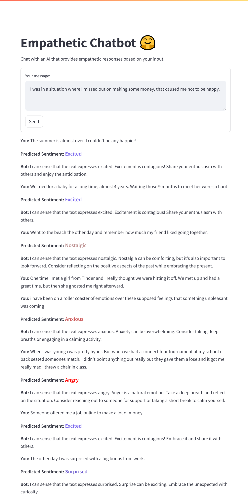
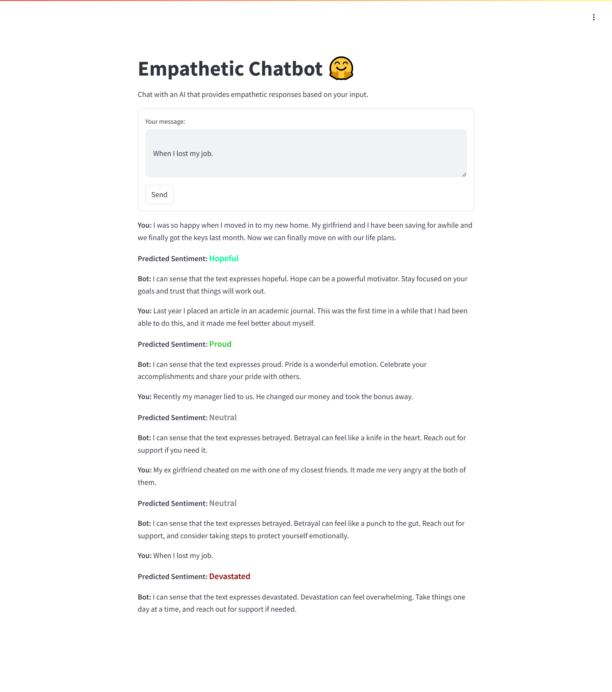
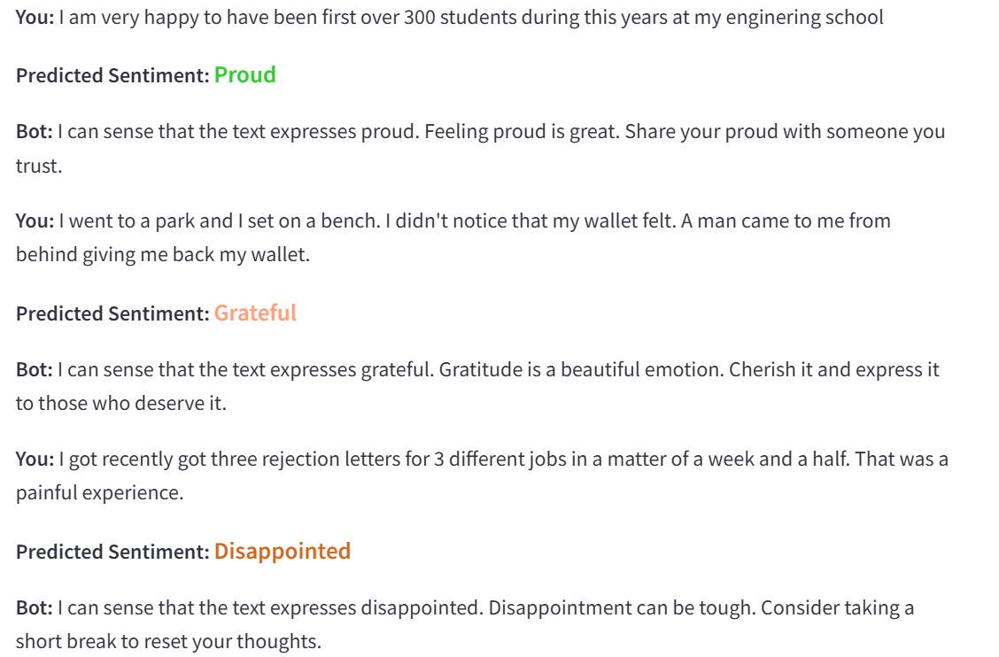

# Model Fine-Tuning and Chatbot Implementation

## Model Fine-Tuning Overview
I fine-tuned the **Meta-Llama-3.1-8B** model using the **Unsloth** framework, applying **memory-efficient quantization** and **optimization techniques** to ensure its suitability for edge devices like mobile phones and Raspberry Pi. The key enhancements in the fine-tuning process are:

- **Memory-Efficient Quantization**: Used **4-bit quantization** to reduce memory usage and improve efficiency, allowing the model to run on devices with limited resources.
- **Dynamic Precision**: Adjusted precision using `fp16` or `bf16` based on hardware capabilities, enabling compatibility with devices like Tesla T4, V100, or Ampere+.

### Customization for Task-Specific Tuning
- **Emotion Detection & Empathy Generation**: The model was specifically trained to detect emotions in user input and generate empathetic responses dynamically.
- **LoRA (Low-Rank Adaptation)**: Incorporated **LoRA** to enhance task-specific tuning. This method improves efficiency and allows the model to be adapted to specific tasks without requiring full retraining, optimizing memory and performance.

### Cultural Sensitivity
- The model was fine-tuned to recognize and adapt to cultural sensitivities, enabling it to respond empathetically while considering regional, linguistic, and societal contexts.
- **Cultural Cues** were added to dynamically adjust empathetic responses based on keywords like "family," "work," and "health."
  
## Notebook Update: Model Output
You can See Finetuned model in this  notebook `colab_notebook/Llaama Fine tune with empathetic data.ipynb`

## Document updated 
You can see full documentation in `docs\Documentation_ Sentiment-Aware Empathetic Chatbot.pdf` folder

# Running a Streamlit App
I implimented model in Streamlit with help of huggingface
To run a Streamlit application locally, follow the steps below:

### Step 1: Install Streamlit
If you haven't installed **Requirment** yet, you can do so using **pip**. Open your terminal or command prompt and run the following command:

`pip install -r requirment.txt`

### Step 2: Run the Streamlit App
Navigate to the directory where your `Streamlit_chatbot_application\chatbot_app.py` file is located and run the following command in your terminal:

`streamlit run chatbot_app.py`

This will start the Streamlit server, and you will see a URL in your terminal (usually something like `http://localhost`). Open this URL in your web browser to interact with your Streamlit app.

### Step 3: Interact with the Chatbot
Once the Streamlit app is running, you can input your situation or emotion into the provided text input field. The chatbot will generate an empathetic response with predicted sentiment.

# Fine Tuned Model Result

Here is an output result for chatbot :

